# Terraform Complete Production Infrastructure on AWS


---

# Project Overview

This project provisions a complete production-ready AWS infrastructure using Terraform with a modular architecture. The infrastructure is automated using GitHub Actions and uses an S3 backend with DynamoDB state locking for secure remote state management.

The project follows Infrastructure as Code (IaC) best practices, modular Terraform design, reusable code, remote state management, monitoring, and automated deployments.

---

# Architecture Diagram

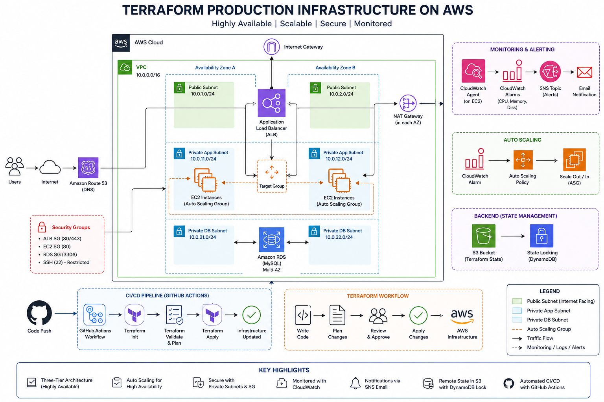

---

# Features

- Modular Terraform project
- Production-ready VPC architecture
- Public & Private Subnets
- Internet Gateway
- NAT Gateway
- Route Tables
- Security Groups
- Launch Template
- Auto Scaling Group
- Application Load Balancer
- Target Group
- EC2 Instances
- RDS MySQL Database
- IAM Roles & Instance Profiles
- CloudWatch Monitoring
- SNS Email Notifications
- Remote State using S3
- State Locking using DynamoDB
- GitHub Actions CI/CD

---

# Architecture Components

## Networking

- Custom VPC
- Public Subnets
- Private Application Subnets
- Private Database Subnets
- Internet Gateway
- NAT Gateway
- Route Tables

## Compute

- EC2
- Launch Template
- Auto Scaling Group

## Load Balancing

- Application Load Balancer
- Target Group
- Listener

## Database

- Amazon RDS MySQL

## Monitoring

- CloudWatch Alarm
- SNS Email Notification
- CloudWatch Agent

## Storage

- S3 Remote Backend
- DynamoDB State Locking

---

# Folder Structure

```text
Terraform-Complete-Production-Project/
│
├── .github/
│   └── workflows/
│       └── terraform.yml
│
├── images/
│
├── modules/
│   ├── alb/
│   ├── asg/
│   ├── cloudwatch/
│   ├── ec2/
│   ├── iam/
│   ├── launch-template/
│   ├── rds/
│   ├── security-groups/
│   └── vpc/
│
├── backend.tf
├── provider.tf
├── variables.tf
├── outputs.tf
├── locals.tf
├── terraform.tfvars
├── main.tf
└── README.md
```

---

# Terraform Modules

| Module | Purpose |
|---------|----------|
| VPC | Creates networking resources |
| Security Groups | Defines security rules |
| IAM | Creates IAM Role & Instance Profile |
| Launch Template | EC2 Launch Configuration |
| Auto Scaling | EC2 Auto Scaling Group |
| ALB | Application Load Balancer |
| RDS | MySQL Database |
| CloudWatch | Monitoring & Alerts |

---

# Infrastructure Workflow

```
Developer
      │
      ▼
GitHub Repository
      │
      ▼
GitHub Actions
      │
      ▼
Terraform Init
      │
Terraform Plan
      │
Terraform Apply
      │
      ▼
AWS Infrastructure
```

---

# Remote Backend

Terraform state is stored securely using:

- Amazon S3 Bucket
- DynamoDB State Locking

Benefits:

- Shared State
- Versioning
- Team Collaboration
- Prevents State Corruption

---

# Monitoring

CloudWatch monitors EC2 CPU utilization.

When CPU > 80%

- Scale Out
- Send Email Notification

When CPU < 20%

- Scale In

CloudWatch Agent is installed automatically using EC2 User Data.

---

# GitHub Actions CI/CD

Workflow includes:

- Checkout Repository
- Configure AWS Credentials
- Terraform Init
- Terraform Plan
- Terraform Apply

Sensitive values such as database password and notification email are managed securely using GitHub Actions Secrets.

---

# Deployment

## Clone Repository

```bash
git clone <repository-url>
```

## Initialize Terraform

```bash
terraform init
```

## Validate

```bash
terraform validate
```

## Plan

```bash
terraform plan
```

## Apply

```bash
terraform apply
```

---

# Project Screenshots

## AWS Architecture


## VPC

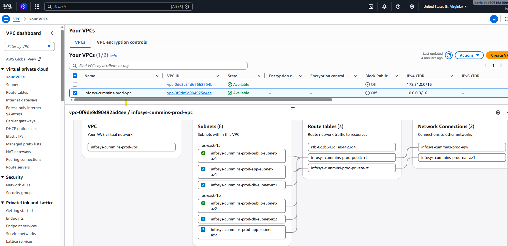

## Public & Private Subnets

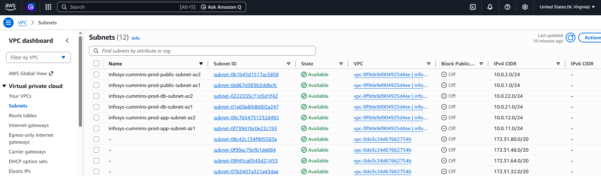

## Route Tables

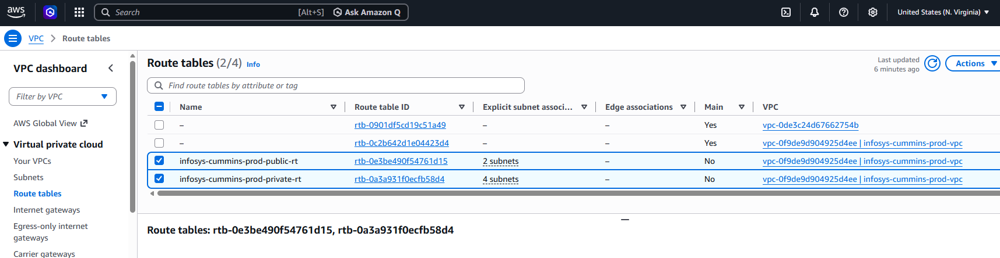

## Internet Gateway

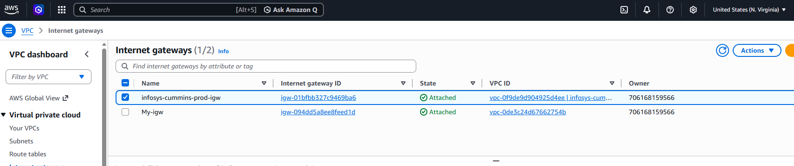

## NAT Gateway

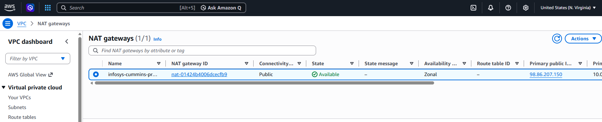

## Security Groups

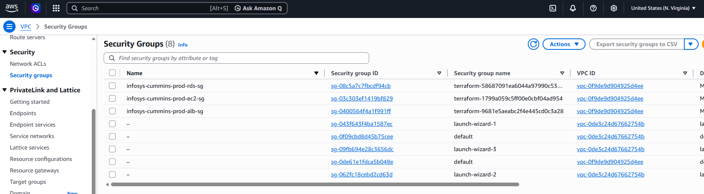

## EC2 Instances

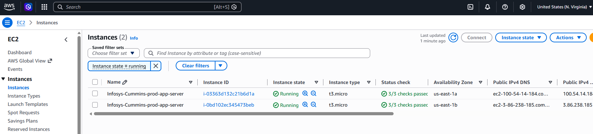

## Launch Template

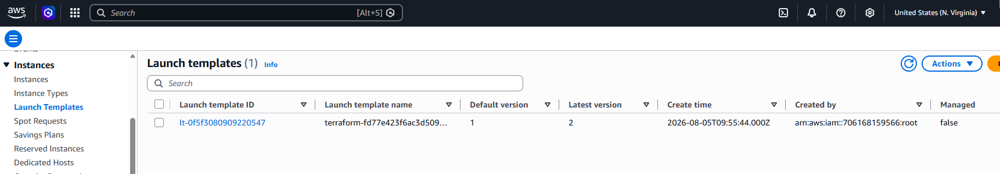

## Auto Scaling Group

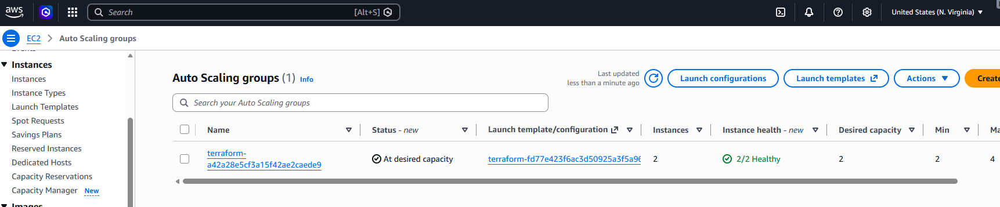

## Application Load Balancer

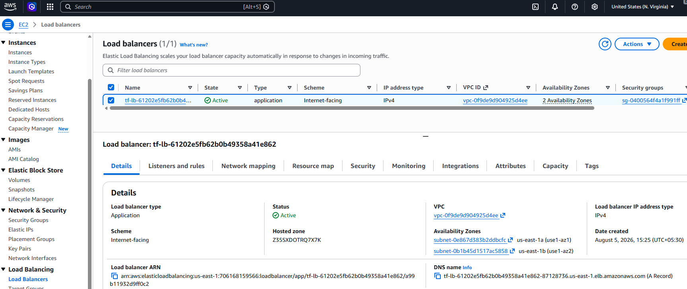

## Target Group

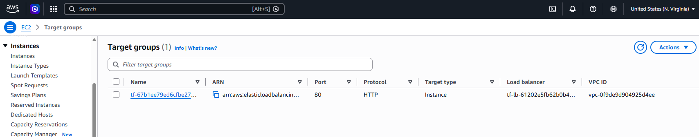

## CloudWatch Alarms


## SNS Notifications


## RDS Database

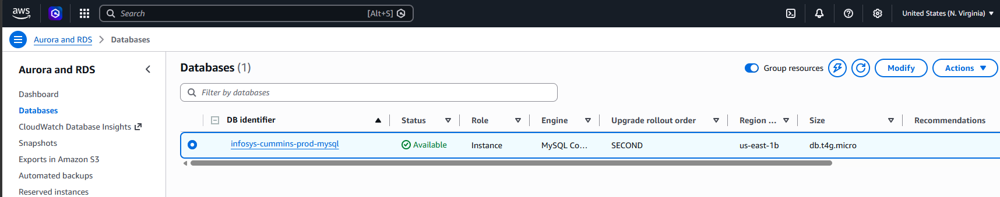

## S3 Backend

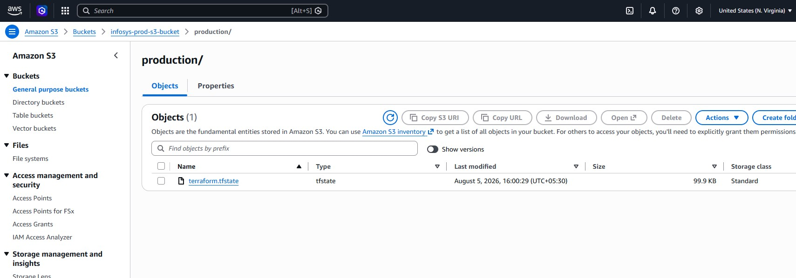

## DynamoDB State Lock


## GitHub Actions


## Application

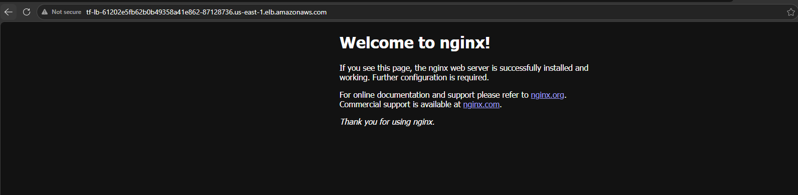

---

# Outputs

Terraform provides:

- ALB DNS Name
- Auto Scaling Group Name
- Load Balancer ARN

---

# Key Learnings

- Infrastructure as Code (IaC)
- Modular Terraform Design
- AWS Networking
- Auto Scaling
- Load Balancing
- RDS Deployment
- CloudWatch Monitoring
- SNS Notifications
- Remote State Management
- GitHub Actions CI/CD

---

# Future Improvements

- HTTPS using ACM
- Route53 Domain Integration
- WAF
- AWS Secrets Manager
- Parameter Store
- Multi-Environment Deployment
- Terraform Workspaces

---

# Author

**Hrutuja Borhade**

AWS Cloud & DevOps Engineer
